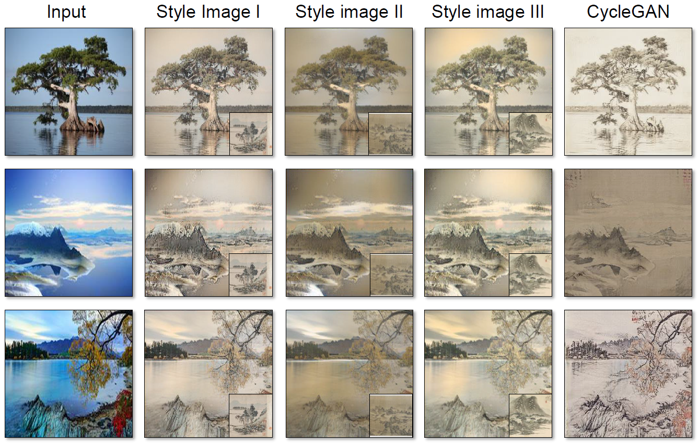

# Chinese-Painting-Generator

Project for SJTU-AU332. 

Implementing transforming a real picture containing natural scenery into Chinese painting style using CycleGAN.

## Code Structure

* [`CycleGAN/`](CycleGAN/): source code of CycleGAN
	* [`train.py`](CycleGAN/train.py): training script
    * [`test.py`](CycleGAN/test.py): test script
    * [`models/`](CycleGAN/models/): model scripts
    * [`util/`](CycleGAN/util/): util scripts
    * [`data/`](CycleGAN/data/): dataset scripts
* [`neural_style_transfer/`](neural_style_transfer/): source code of Neural Style Transfer
	* [`main.py`](neural_style_transfer/main.py): main script to run neural style transfer
    * [`LossFunction.py`](neural_style_transfer/LossFunction.py): loss function script
    * [`data/`](neural_style_transfer/data/): style images and content images
    * [`results/`](neural_style_transfer/results/): some sample results

## How to run the experiments

* [`CycleGAN`](CycleGAN/)

    To run training script, first, change directory to where the script locates, and put trainA and trainB into directory `dataroot`. Then use command `python train.py --dataroot dataroot` in terminal. Use command `python train.py --help` for more instructions.
    
    To run testing script, first, change directory to where the script locates, put test data into directory `dataroot` and put pretrained model into directory `./checkpoints/xxx` where `xxx` is the `name` you defined in terminal. Then use command `python test.py --dataroot dataroot --name name` in terminal. Use command `python test.py --help` for more instructions.
    
    Our pretrained Model: download [here](https://jbox.sjtu.edu.cn/l/3Jv9F0)

* [`neural_style_transfer`](neural_style_transfer/)

    First, change directory to where the `main.py` script locates, put content images into directory `content_img_dir`, and put style images into path `style_img_path`. Then use command `python main.py --content_img_dir content_img_dir --style_img_path style_img_path` in terminal. Use command `python main.py --help` for more instructions.

## Requirements

The code requires only common Python environments for machine learning; Basicially, it was tested with

* Python 3 (Anaconda 3.6.3 specifically)
* PyTorch\==0.3.1
* numpy\==1.18.5
* tqdm
* pillow
* matplotlib
* argparse

Higher (or lower) versions should also work (perhaps with minor modifications).

**Dataset**

download [here](https://jbox.sjtu.edu.cn/l/Z0i6Jb)

Adapted from : 

[Traditional Chinese Landscape Painting Dataset](https://github.com/alicex2020/Chinese-Landscape-Painting-Dataset)

[Landscape Dataset](https://github.com/yuweiming70/Landscape-Dataset/)

